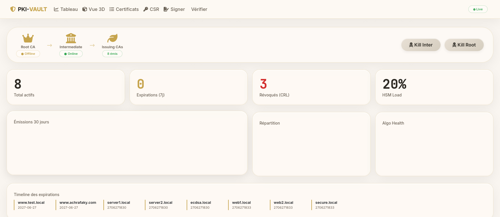
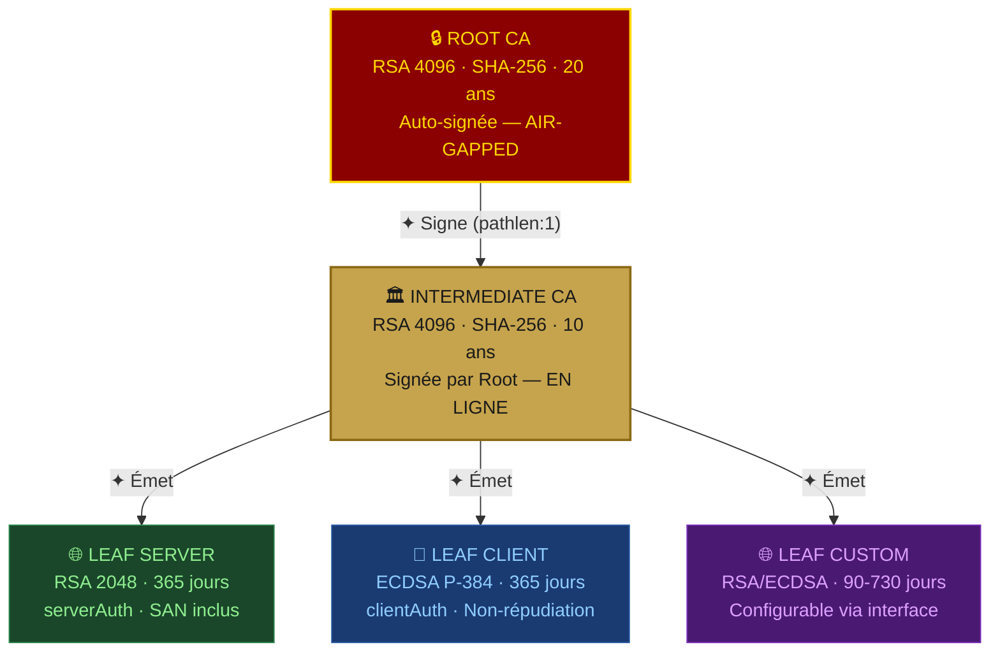
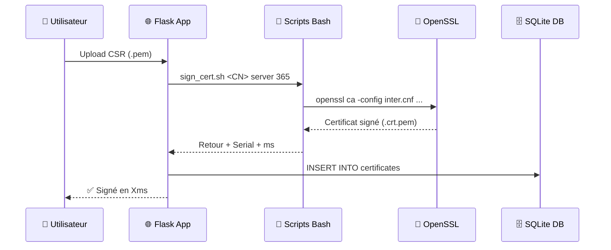
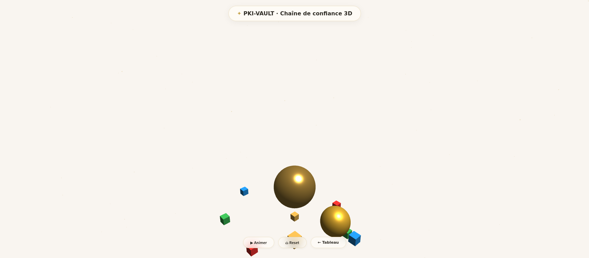
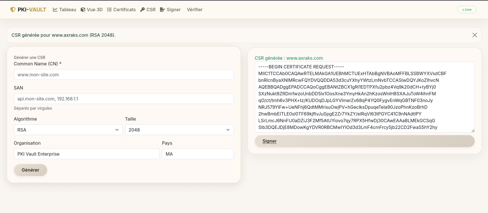
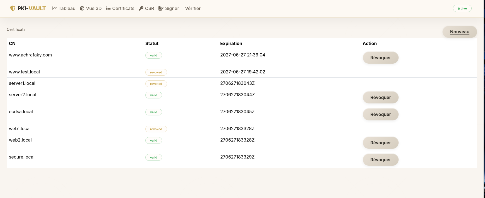
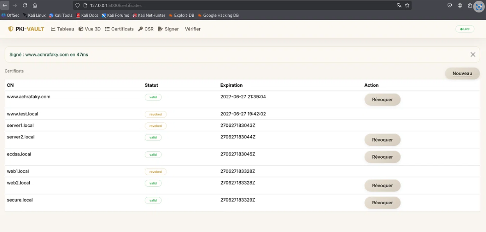
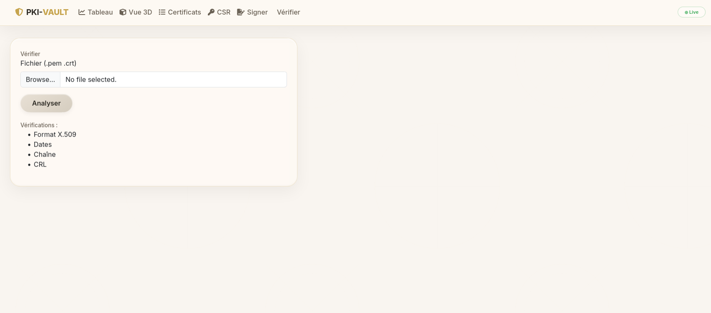

<div align="center">

```
██████╗ ██╗  ██╗██╗    ██╗   ██╗ █████╗ ██╗   ██╗██╗  ████████╗
██╔══██╗██║ ██╔╝██║    ██║   ██║██╔══██╗██║   ██║██║  ╚══██╔══╝
██████╔╝█████╔╝ ██║    ██║   ██║███████║██║   ██║██║     ██║
██╔═══╝ ██╔═██╗ ██║    ╚██╗ ██╔╝██╔══██║██║   ██║██║     ██║
██║     ██║  ██╗██║     ╚████╔╝ ██║  ██║╚██████╔╝███████╗██║
╚═╝     ╚═╝  ╚═╝╚═╝      ╚═══╝  ╚═╝  ╚═╝ ╚═════╝ ╚══════╝╚═╝
```

### *"La sécurité numérique commence par une confiance bien construite."*

---

[](https://www.python.org/)
[](https://flask.palletsprojects.com/)
[](https://www.openssl.org/)
[](https://threejs.org/)
[](https://getbootstrap.com/)
[](LICENSE)

[](https://datatracker.ietf.org/doc/html/rfc5280)
[](https://datatracker.ietf.org/doc/html/rfc5280)
[](https://csrc.nist.gov/publications/detail/sp/800-57-part-1/rev-5/final)
[]()
[]()
[]()
[]()
[]()

</div>

---

## 🖥️ Aperçu — Dashboard en direct

<div align="center">



*Tableau de bord temps réel — KPI live · Graphiques Chart.js · Timeline des expirations · Kill Switch*

</div>

---

## 📐 Architecture PKI à Trois Niveaux





---

## ✨ Galerie des fonctionnalités

<table>
<tr>
<td width="50%" align="center">

### 📊 Tableau de bord

*KPI temps réel · Timeline · Audit Console Live · Simulateur d'impact · Kill Switch*

</td>
<td width="50%" align="center">

### 🔮 Vue 3D Three.js

*Chaîne de confiance interactive en 3D · Sphères métallisées · Animations orbitales*

</td>
</tr>
<tr>
<td width="50%" align="center">

### 🔑 Génération de CSR

*RSA 2048/4096 ou ECDSA P-256/P-384 · SAN multiples · Formulaire web intuitif*

</td>
<td width="50%" align="center">

### 📋 Gestion des certificats

*Liste complète · Statuts colorés · Révocation en un clic · Filtres par statut*

</td>
</tr>
<tr>
<td width="50%" align="center">

### ✍️ Signature de CSR

*Upload CSR · Choix CA · Type server/client · Durée configurable · Résultat en ms*

</td>
<td width="50%" align="center">

### ✅ Vérification certificat

*5 vérifications · Score /5 · Format X.509 · Dates · Chaîne · CRL · Algo*

</td>
</tr>
</table>

---

## 🚀 Installation en 3 minutes

<details>
<summary><b>📦 Étape 1 — Prérequis système</b></summary>

```bash
sudo apt update && sudo apt install -y \
    openssl python3 python3-pip python3-venv git tree
```

Versions requises :
- OpenSSL ≥ 3.0 (`openssl version`)
- Python ≥ 3.10 (`python3 --version`)

</details>

<details>
<summary><b>⬇️ Étape 2 — Cloner et configurer</b></summary>

```bash
# Cloner le dépôt
git clone https://github.com/achrafaky/pki-vault-da-vinci.git
cd pki-vault-da-vinci

# Environnement virtuel Python
python3 -m venv venv && source venv/bin/activate

# Installer les dépendances
pip install -r requirements.txt
```

</details>

<details>
<summary><b>🔐 Étape 3 — Initialiser la PKI</b></summary>

```bash
# Lance la génération complète :
# Root CA (RSA 4096) → Intermediate CA (RSA 4096) → CRL → Vérification chaîne
bash scripts/init_ca.sh
```

Sortie attendue :
```
━━ 1/5 — Bases de données ━━
[✔] Bases de données initialisées
━━ 2/5 — Root CA (RSA 4096 · 20 ans) ━━
[✔] Clé Root générée (chmod 400)
[✔] Root CA auto-signée (20 ans)
━━ 3/5 — Intermediate CA (RSA 4096 · 10 ans) ━━
[✔] Clé Intermediate générée
[✔] Intermediate signée par Root + chaîne créée
━━ 4/5 — CRL initiales ━━
[✔] CRL générées
━━ 5/5 — Vérification chaîne ━━
[✔] Root → Intermediate : ✔ VALIDE

╔════════════════════════════════╗
║  ✅  PKI INITIALISÉE           ║
╚════════════════════════════════╝
```

</details>

<details>
<summary><b>▶️ Étape 4 — Lancer l'application</b></summary>

```bash
python3 run.py
```

| URL | Description |
|-----|-------------|
| `http://localhost:5000` | 📊 Tableau de bord principal |
| `http://localhost:5000/viz` | 🔮 Vue 3D Three.js |
| `http://localhost:5000/generate` | 🔑 Générer une CSR |
| `http://localhost:5000/sign` | ✍️ Signer un certificat |
| `http://localhost:5000/certificates` | 📋 Liste des certificats |
| `http://localhost:5000/verify` | ✅ Vérifier un certificat |
| `http://localhost:5000/download/crl` | 📥 Télécharger la CRL |
| `http://localhost:5000/download/chain` | 📥 Télécharger la chaîne |

</details>

---

## 🛠️ Commandes Bash

```bash
# ─── Génération CSR ───────────────────────────────────────────────────────────
bash scripts/gen_csr.sh <CN> [SANs] [rsa|ecdsa] [taille]

# Exemples
bash scripts/gen_csr.sh "api.monsite.com" "www.monsite.com,192.168.1.1" rsa 2048
bash scripts/gen_csr.sh "secure.app.com" "" ecdsa 384

# ─── Signature ────────────────────────────────────────────────────────────────
bash scripts/sign_cert.sh <CN> [server|client] [jours]

# Exemples
bash scripts/sign_cert.sh "api.monsite.com" server 365
bash scripts/sign_cert.sh "client.vpn.com" client 90

# ─── Vérification (score /5) ──────────────────────────────────────────────────
bash scripts/verify.sh pki/leaf/certs/<CN>.crt.pem

# Sortie :
# ✔ Format X.509 valide
# ✔ Dates valides
# ✔ Chaîne Root→Inter→Leaf valide
# ✔ Non révoqué (CRL vérifiée)
# ✔ Algorithme moderne (SHA-256+)
# Score : 5/5 (100%) ✅ PARFAIT

# ─── Révocation ───────────────────────────────────────────────────────────────
bash scripts/revoke.sh pki/leaf/certs/<CN>.crt.pem [raison]
# Raisons : keyCompromise · superseded · affiliationChanged · cessationOfOperation

# ─── Démo complète (6 étapes automatiques) ───────────────────────────────────
bash scripts/demo.sh
```

---

## 📊 Paramètres cryptographiques (NIST SP 800-57)

| Composant | Algorithme | Taille clé | Niveau sécurité | Durée |
|:----------|:----------:|:----------:|:---------------:|:-----:|
| Root CA | RSA | 4096 bits | **128 bits** | 20 ans |
| Intermediate CA | RSA | 4096 bits | **128 bits** | 10 ans |
| Leaf Server | RSA | 2048 bits | **112 bits** | 365 jours |
| Leaf Client | ECDSA | P-384 | **192 bits** | 365 jours |
| Hash | SHA-256 | — | — | Toujours |
| SHA-1 | ❌ Refusé | — | — | Interdit |

> **Référence :** [NIST SP 800-57 Part 1 Rev.5](https://csrc.nist.gov/publications/detail/sp/800-57-part-1/rev-5/final)

---

## 🔐 Architecture de sécurité

```
COUCHE 1 — ROOT CA (AIR-GAPPED)
┌──────────────────────────────────────────────────────────────┐
│  • Clé RSA 4096 chiffrée AES-256 (passphrase)               │
│  • chmod 400 sur root.key.pem                                │
│  • Hors ligne : utilisée uniquement pour signer l'Inter CA   │
│  • pathlen:1 — ne peut signer QUE des Intermediate CAs       │
└──────────────────────────────────────────────────────────────┘

COUCHE 2 — INTERMEDIATE CA (EN LIGNE)
┌──────────────────────────────────────────────────────────────┐
│  • Clé RSA 4096 chiffrée AES-256                             │
│  • CRL renouvelée à chaque révocation                        │
│  • pathlen:0 — ne peut PAS signer d'autres CAs               │
│  • copy_extensions = copy (SAN transmis depuis la CSR)       │
└──────────────────────────────────────────────────────────────┘

COUCHE 3 — LEAF CERTIFICATES
┌──────────────────────────────────────────────────────────────┐
│  • CA:FALSE obligatoire                                       │
│  • SAN (Subject Alternative Name) toujours présent          │
│  • Durée maximale : 365 jours (renouvellement annuel)        │
│  • Vérification CRL à chaque validation                      │
└──────────────────────────────────────────────────────────────┘
```

---

## 📂 Structure du projet

```
pki-vault-da-vinci/
├── 📄 run.py                    # Point d'entrée Flask
├── 📄 requirements.txt          # Dépendances Python
├── 📄 Makefile                  # Automatisation (init, run, test, demo, clean)
├── ⚙️  config/
│   ├── root.cnf                 # Configuration complète Root CA
│   └── inter.cnf                # Configuration complète Intermediate CA
├── 📜 scripts/
│   ├── init_ca.sh               # Initialisation PKI en 5 étapes
│   ├── gen_csr.sh               # Génération clé + CSR (RSA ou ECDSA)
│   ├── sign_cert.sh             # Signature + vérification chaîne
│   ├── revoke.sh                # Révocation + mise à jour CRL
│   ├── verify.sh                # Vérification 5 points (score /5)
│   └── demo.sh                  # Démo complète automatique (6 scènes)
├── 🔐 pki/
│   ├── root/{private,certs,crl,db,newcerts}/
│   ├── intermediate/{private,certs,crl,db,newcerts,csr}/
│   └── leaf/{private,certs,csr}/
├── 🐍 app/
│   ├── app.py                   # 11 routes Flask (dashboard, generate, sign...)
│   ├── models.py                # SQLite — certificates + audit_logs
│   ├── crypto_utils.py          # Couche OpenSSL Python
│   ├── templates/               # 7 templates Jinja2
│   └── static/css/dashboard.css # Thème Da Vinci (262 lignes)
└── 🐍 python/
    ├── run.py                   # Lanceur alternatif
    └── sync_db.py               # Sync index.txt ↔ SQLite
```

---

## 🌐 API REST

| Endpoint | Méthode | Description |
|----------|---------|-------------|
| `/api/stats` | GET | Statistiques JSON temps réel |
| `/api/advanced-stats` | GET | KPI avancés (total, expirations, HSM) |
| `/api/algo-health` | GET | Répartition RSA / ECDSA / Post-Quantum |
| `/api/timeline` | GET | Timeline des expirations |
| `/api/impact/<ca_type>` | GET | Simulation impact révocation CA |
| `/api/logs` | GET | 5 derniers événements d'audit |
| `/api/root-status` | GET | Statut Root CA (online/offline) |
| `/api/graph-data` | GET | Données pour visualisation PKI |
| `/download/crl` | GET | Télécharger `inter.crl.pem` |
| `/download/chain` | GET | Télécharger `chain.crt.pem` |
| `/kill/<ca_type>` | POST | 🚨 Kill Switch — révocation massive |

---

## 🧪 Démonstration complète

```bash
# Lance le scénario complet en une commande :
bash scripts/demo.sh
```

```
╔══ 1/6 · Initialisation PKI ══╗
[✔] PKI initialisée

╔══ 2/6 · Certificat RSA — api.demo.local ══╗
[✔] api.demo.local (RSA 2048)

╔══ 3/6 · Certificat ECDSA — store.demo.local ══╗
[✔] store.demo.local (ECDSA P-384)

╔══ 4/6 · Vérification chaînes ══╗
Score : 5/5 (100%) ✅ PARFAIT

╔══ 5/6 · Révocation api.demo.local ══╗
[✔] Révoqué + CRL mise à jour

╔══ 6/6 · Vérification post-révocation ══╗
[✔] api.demo.local  → ❌ RÉVOQUÉ (correct)
[✔] store.demo.local → ✅ VALIDE

╔══════════════════════════════════════╗
║  🏆  DÉMO TERMINÉE en 8 secondes   ║
╚══════════════════════════════════════╝
```

---

## 🧩 Technologies

<div align="center">

| Couche | Technologie | Rôle |
|:------:|:-----------:|:----:|
| 🔐 Crypto | OpenSSL 3.0+ | Génération clés, CSR, signature, CRL |
| 🐍 Backend | Python 3.10 + Flask 3.0 | API REST + templates Jinja2 |
| 🔑 Crypto Python | cryptography 42.0 | Parsing X.509, génération clés |
| 🗄️ Base de données | SQLite 3 | Certificats + journal d'audit |
| 🎨 Frontend | Bootstrap 5.3.2 + CSS custom | Interface Da Vinci Light |
| 📊 Graphiques | Chart.js 4.4 | KPI temps réel, donuts, courbes |
| 🔮 3D | Three.js r128 | Vue chaîne de confiance interactive |
| ⚙️ Automation | Bash + Makefile | Scripts PKI + démo |

</div>

---

## 🤝 Contributeurs

<div align="center">

| Rôle | Nom |
|:----:|:----|
| 👨‍💻 **Auteur & Développeur** | **Achraf Akiyaf** — Master MMSD, FST Tanger |
| 👩‍🏫 **Encadrante** | Pr. LECHHAB OUADRASSI Nihad |
| 👨‍🏫 **Co-superviseur** | Pr. AZMANI Abdellah |
| 🏛️ **Établissement** | Faculté des Sciences et Techniques — Tanger |
| 📚 **Module** | Cryptographie et Blockchain |

</div>

---

## 📜 Licence

```
MIT License — Copyright (c) 2025 Achraf Akiyaf

Permission is hereby granted, free of charge, to any person obtaining a copy
of this software to use, copy, modify, merge, publish, distribute, sublicense,
and/or sell copies of the Software.
```

---

<div align="center">

**⭐ Si ce projet vous a été utile, n'oubliez pas de laisser une étoile !**

[](https://github.com/achrafaky/pki-vault-da-vinci/stargazers)
[](https://github.com/achrafaky/pki-vault-da-vinci/network/members)

---

*Réalisé avec passion dans le cadre du Master MMSD · FST Tanger · 2025*

[🔝 Retour en haut](#)

</div>
